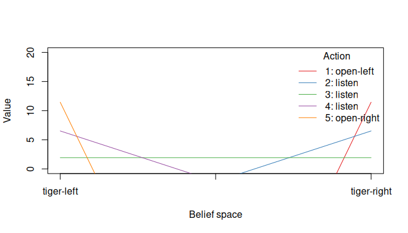
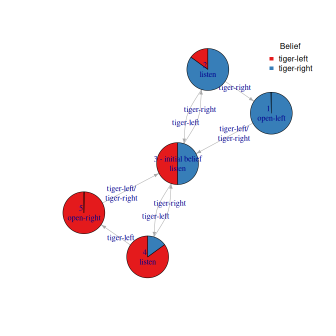

R package pomdp: Partially Observable Markov Decision Processes
================

[](https://CRAN.R-project.org/package=pomdp)
[](https://mhahsler.r-universe.dev/ui#package:pomdp)
[](https://CRAN.R-project.org/package=pomdp)

Provides the infrastructure to define and analyze the solutions of
Partially Observable Markov Decision Processes (POMDP) models. The
package uses the solvers from [pomdp-solve](http://www.pomdp.org/code/)
(Cassandra, 2015) available in the R package
[**pomdpSolve**](https://github.com/mhahsler/pomdpSolve) to solve POMDPs
using a variety of algorithms.

The package provides the following algorithms:

-   Exact value iteration
    -   **Enumeration algorithm** (Sondik 1971, Mohan 1982).
    -   **Two pass algorithm** (Sondik 1971).
    -   **Witness algorithm** (Littman, Cassandra, Kaelbling 1996).
    -   **Incremental pruning algorithm** (Zhang and Liu 1996, Cassandra
        et al 1997).
-   Approximate value iteration
    -   **Finite grid algorithm** (Cassandra 2015), a variation of
        point-based value iteration to solve larger POMDPs (**PBVI**;
        see Pineau 2003) without dynamic belief set expansion.
    -   **SARSOP** (Kurniawati, Hsu and Lee 2008), point-based algorithm
        that approximates optimally reachable belief spaces for
        infinite-horizon problems (via package
        [sarsop](https://github.com/boettiger-lab/sarsop)).

## Installation

**Stable CRAN version:** install from within R with

``` r
install.packages("pomdp")
```

**Current development version:** Install from
[r-universe.](https://mhahsler.r-universe.dev/ui#package:pomdp)

## Usage

Solving the simple infinite-horizon Tiger problem.

``` r
library("pomdp")
data("Tiger")
Tiger
```

    ## POMDP, list - Tiger Problem
    ##   Discount factor: 0.75
    ##   Horizon: Inf epochs
    ##   List components: 'name', 'discount', 'horizon', 'states', 'actions',
    ##     'observations', 'transition_prob', 'observation_prob', 'reward',
    ##     'start', 'terminal_values'

``` r
sol <- solve_POMDP(model = Tiger)
sol
```

    ## POMDP, list - Tiger Problem
    ##   Discount factor: 0.75
    ##   Horizon: Inf epochs
    ##   Solved:
    ##     Solution converged: TRUE
    ##     Total expected reward: 1.933439
    ##   List components: 'name', 'discount', 'horizon', 'states', 'actions',
    ##     'observations', 'transition_prob', 'observation_prob', 'reward',
    ##     'start', 'solution', 'solver_output'

``` r
plot_value_function(sol, ylim = c(0, 20))
```

<!-- -->

``` r
plot_policy_graph(sol)
```

<!-- -->

## References

-   Cassandra, A. (2015). pomdp-solve: POMDP Solver Software,
    <http://www.pomdp.org>.
-   Sondik, E. (1971). The Optimal Control of Partially Observable
    Markov Processes. Ph.D. Dissertation, Stanford University.
-   Cassandra, A., Littman M.L., Zhang L. (1997). Incremental Pruning: A
    Simple, Fast, Exact Algorithm for Partially Observable Markov
    Decision Processes. UAI’97: Proceedings of the Thirteenth conference
    on Uncertainty in artificial intelligence, August 1997, pp. 54-61.
-   Monahan, G. E. (1982). A survey of partially observable Markov
    decision processes: Theory, models, and algorithms. Management
    Science 28(1):1-16.
-   Littman, M. L.; Cassandra, A. R.; and Kaelbling, L. P. (1996).
    Efficient dynamic-programming updates in partially observable Markov
    decision processes. Technical Report CS-95-19, Brown University,
    Providence, RI.
-   Zhang, N. L., and Liu, W. (1996). Planning in stochastic domains:
    Problem characteristics and approximation. Technical Report
    HKUST-CS96-31, Department of Computer Science, Hong Kong University
    of Science and Technology.
-   Pineau, J., Gordon, G.J., Thrun, S.B. (2003). Point-based value
    iteration: an anytime algorithm for POMDPs. IJCAI’03: Proceedings of
    the 18th international joint conference on Artificial Intelligence.
    Pages 1025-1030.
-   Kurniawati, H., Hsu, D., and Lee, W.S. (2008). SARSOP: Efficient
    point-based POMDP planning by approximating optimally reachable
    belief spaces. In Proc. Robotics: Science and Systems.

## Acknowledgments

Development of this package was supported in part by National Institute
of Standards and Technology (NIST) under grant number
[60NANB17D180](https://www.nist.gov/ctl/pscr/safe-net-integrated-connected-vehicle-computing-platform).
