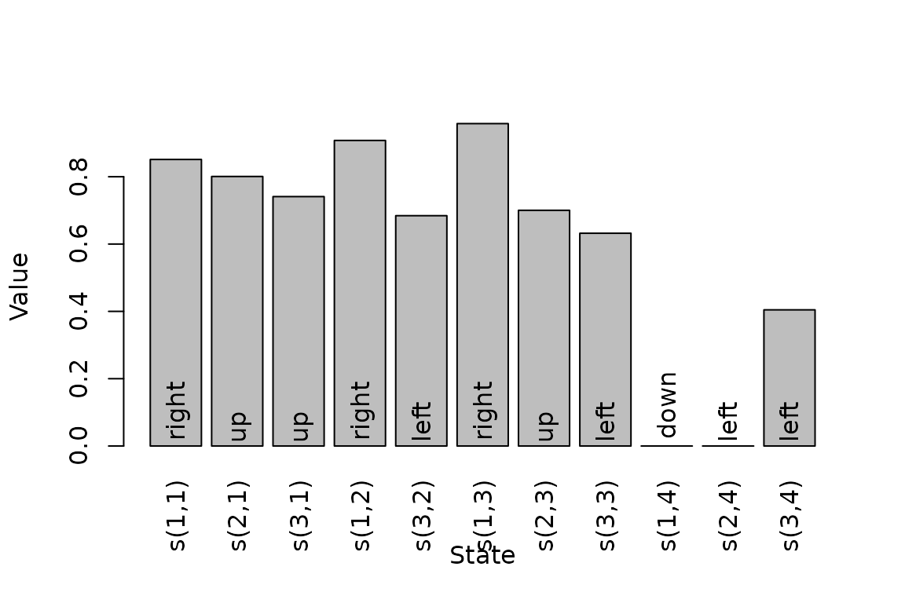
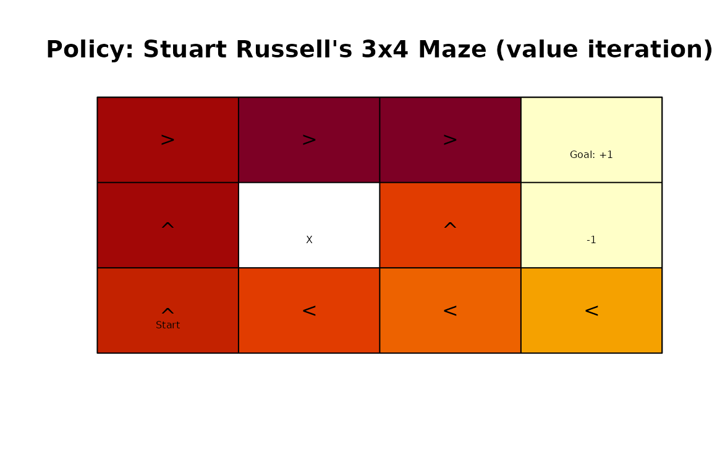
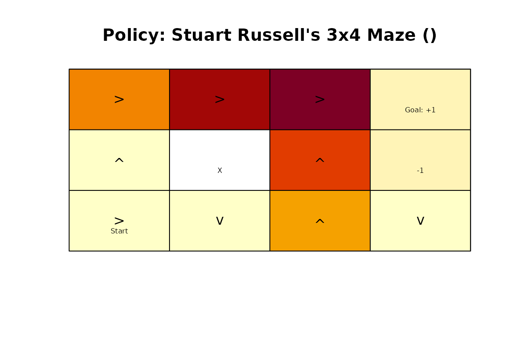

# Solving Markov Decision Processes with pomdp

``` r

library(pomdp)
```

## Introduction

A Markov decision process (MDP) describes sequential decision making
when the state of the environment is completely observable. At every
epoch, the agent observes the current state, chooses an action, receives
a reward, and moves to a new state according to the transition
probabilities. The objective is to find a policy that maximizes the
expected sum of future rewards.

A finite-state MDP is described by states \\S\\, actions \\A\\,
transition probabilities \\T(s' \mid s,a)\\, rewards \\R(s,a,s')\\, and
a discount factor \\\gamma\\. The package **pomdp** represents these
components with an `MDP` object and solves the model with
[`solve_MDP()`](http://michael.hahsler.net/pomdp/reference/solve_MDP.md).
Both dynamic programming and temporal-difference control methods are
available (Sutton and Barto 2018).

The basic workflow is:

1.  Define a model with
    [`MDP()`](http://michael.hahsler.net/pomdp/reference/MDP.md) or load
    one of the included examples.
2.  Find a policy with
    [`solve_MDP()`](http://michael.hahsler.net/pomdp/reference/solve_MDP.md).
3.  Inspect, visualize, evaluate, or simulate the policy.

## An Example MDP

We use the included `Maze` model. It is a gridworld with one start
state, two terminal states, and one wall. The agent can move up, right,
down, or left.

``` r

data(Maze)
Maze
#> MDP, list - Stuart Russell's 3x4 Maze
#>   Discount factor: 1
#>   Horizon: Inf epochs
#>   Size: 11 states / 4 actions
#>   Start: 0, 0, 1, 0, 0, 0, 0, 0, 0, 0, 0
#> 
#>   List components: 'name', 'discount', 'horizon', 'states', 'actions',
#>     'transition_prob', 'reward', 'info', 'start'
```

An MDP is stored as a list. Its most important components are the
states, actions, transition model, reward model, discount factor,
horizon, and start distribution.

``` r

Maze$states
#>  [1] "s(1,1)" "s(2,1)" "s(3,1)" "s(1,2)" "s(3,2)" "s(1,3)" "s(2,3)" "s(3,3)"
#>  [9] "s(1,4)" "s(2,4)" "s(3,4)"
Maze$actions
#> [1] "up"    "right" "down"  "left"
Maze$discount
#> [1] 1
Maze$horizon
#> [1] Inf
Maze$start
#> s(1,1) s(2,1) s(3,1) s(1,2) s(3,2) s(1,3) s(2,3) s(3,3) s(1,4) s(2,4) s(3,4) 
#>      0      0      1      0      0      0      0      0      0      0      0
```

Use
[`transition_matrix()`](http://michael.hahsler.net/pomdp/reference/accessors.md)
and
[`reward_matrix()`](http://michael.hahsler.net/pomdp/reference/accessors.md)
to inspect normalized model components. For example, the following
matrix contains the transition probabilities for moving up.

``` r

transition_matrix(Maze, action = "up")
#>        s(1,1) s(2,1) s(3,1) s(1,2) s(3,2) s(1,3) s(2,3) s(3,3) s(1,4) s(2,4)
#> s(1,1)    0.9    0.0    0.0    0.1    0.0    0.0    0.0    0.0    0.0    0.0
#> s(2,1)    0.8    0.2    0.0    0.0    0.0    0.0    0.0    0.0    0.0    0.0
#> s(3,1)    0.0    0.8    0.1    0.0    0.1    0.0    0.0    0.0    0.0    0.0
#> s(1,2)    0.1    0.0    0.0    0.8    0.0    0.1    0.0    0.0    0.0    0.0
#> s(3,2)    0.0    0.0    0.1    0.0    0.8    0.0    0.0    0.1    0.0    0.0
#> s(1,3)    0.0    0.0    0.0    0.1    0.0    0.8    0.0    0.0    0.1    0.0
#> s(2,3)    0.0    0.0    0.0    0.0    0.0    0.8    0.1    0.0    0.0    0.1
#> s(3,3)    0.0    0.0    0.0    0.0    0.1    0.0    0.8    0.0    0.0    0.0
#> s(1,4)    0.0    0.0    0.0    0.0    0.0    0.0    0.0    0.0    1.0    0.0
#> s(2,4)    0.0    0.0    0.0    0.0    0.0    0.0    0.0    0.0    0.0    1.0
#> s(3,4)    0.0    0.0    0.0    0.0    0.0    0.0    0.0    0.1    0.0    0.8
#>        s(3,4)
#> s(1,1)    0.0
#> s(2,1)    0.0
#> s(3,1)    0.0
#> s(1,2)    0.0
#> s(3,2)    0.0
#> s(1,3)    0.0
#> s(2,3)    0.0
#> s(3,3)    0.1
#> s(1,4)    0.0
#> s(2,4)    0.0
#> s(3,4)    0.1
```

Models can be created directly with
[`MDP()`](http://michael.hahsler.net/pomdp/reference/MDP.md). Transition
probabilities can be specified as matrices, data frames built with
[`T_()`](http://michael.hahsler.net/pomdp/reference/POMDP.md), or
functions. Rewards can similarly be specified as matrices, data frames
built with
[`R_()`](http://michael.hahsler.net/pomdp/reference/POMDP.md), or
functions. See
[`?MDP`](http://michael.hahsler.net/pomdp/reference/MDP.md) for complete
examples and the supported shortcuts.

## Solving an Infinite-Horizon MDP

[`solve_MDP()`](http://michael.hahsler.net/pomdp/reference/solve_MDP.md)
provides two model-based dynamic programming methods and three
model-free temporal-difference methods:

- `"value_iteration"` applies Bellman optimality backups until the value
  function converges.
- `"policy_iteration"` alternates approximate policy evaluation and
  greedy policy improvement.
- `"q_learning"` learns an off-policy action-value function.
- `"sarsa"` learns an action-value function on-policy.
- `"expected_sarsa"` uses the expected value under the current policy in
  its update.

Value iteration is the default. It is a good starting point when the
complete transition and reward models are available.

``` r

maze_solved <- solve_MDP(Maze, method = "value_iteration")
maze_solved
#> MDP, list - Stuart Russell's 3x4 Maze
#>   Discount factor: 1
#>   Horizon: Inf epochs
#>   Size: 11 states / 4 actions
#>   Start: 0, 0, 1, 0, 0, 0, 0, 0, 0, 0, 0
#>   Solved:
#>     Method: 'value iteration'
#>     Solution converged: TRUE
#> 
#>   List components: 'name', 'discount', 'horizon', 'states', 'actions',
#>     'transition_prob', 'reward', 'info', 'start', 'solution'
```

The returned object contains the original model and a `solution`
component. For an infinite-horizon dynamic programming solution, the
latter records the method, convergence status, final value-function
change, number of iterations, and policy.

``` r

maze_solved$solution[c("method", "converged", "delta", "iterations")]
#> $method
#> [1] "value iteration"
#> 
#> $converged
#> [1] TRUE
#> 
#> $delta
#> [1] 0.009858138
#> 
#> $iterations
#> [1] 13
```

[`policy()`](http://michael.hahsler.net/pomdp/reference/policy.md)
extracts the solution as one row per state. The column `U` is the
expected discounted return from that state, and `action` is the action
selected by the policy.

``` r

policy(maze_solved)
#>     state         U action
#> 1  s(1,1) 0.8513071  right
#> 2  s(2,1) 0.8007595     up
#> 3  s(3,1) 0.7409561     up
#> 4  s(1,2) 0.9077989  right
#> 5  s(3,2) 0.6842791   left
#> 6  s(1,3) 0.9578061  right
#> 7  s(2,3) 0.7002680     up
#> 8  s(3,3) 0.6321148   left
#> 9  s(1,4) 0.0000000   down
#> 10 s(2,4) 0.0000000   left
#> 11 s(3,4) 0.4045407   left
```

The action-value function \\Q(s,a)\\ gives the expected return from
taking action \\a\\ in state \\s\\ and then following the policy. It is
useful for comparing the available actions in each state.

``` r

round(q_values_MDP(maze_solved), 2)
#>           up right down left
#> s(1,1)  0.82  0.85 0.78 0.81
#> s(2,1)  0.80  0.76 0.71 0.76
#> s(3,1)  0.74  0.66 0.70 0.71
#> s(1,2)  0.87  0.91 0.87 0.82
#> s(3,2)  0.64  0.60 0.64 0.69
#> s(1,3)  0.92  0.96 0.71 0.85
#> s(2,3)  0.70 -0.65 0.44 0.68
#> s(3,3)  0.63  0.42 0.57 0.64
#> s(1,4)  0.00  0.00 0.00 0.00
#> s(2,4)  0.00  0.00 0.00 0.00
#> s(3,4) -0.70  0.23 0.39 0.41
```

The value function and the gridworld policy can also be visualized.

``` r

plot_value_function(maze_solved)
```



``` r

gridworld_plot_policy(maze_solved)
```



## Choosing Dynamic Programming Parameters

For value iteration, `error` controls the maximum policy loss used in
the convergence criterion, while `N_max` limits the number of
iterations. An initial value function can be supplied with `U`.

``` r

maze_precise <- solve_MDP(
  Maze,
  method = "value_iteration",
  error = 1e-5,
  N_max = 1000
)
maze_precise$solution[c("converged", "delta", "iterations")]
#> $converged
#> [1] TRUE
#> 
#> $delta
#> [1] 9.760517e-06
#> 
#> $iterations
#> [1] 25
```

Modified policy iteration starts with a random policy. In each iteration
it uses `k_backups` Bellman backups to approximately evaluate the
current policy, then replaces it with a greedy policy. It stops when the
policy no longer changes.

``` r

maze_policy_iteration <- solve_MDP(
  Maze,
  method = "policy_iteration",
  k_backups = 10
)
maze_policy_iteration$solution[c("converged", "iterations")]
#> $converged
#> [1] TRUE
#> 
#> $iterations
#> [1] 5
policy(maze_policy_iteration)
#>     state         U action
#> 1  s(1,1) 0.8515581  right
#> 2  s(2,1) 0.8015579     up
#> 3  s(3,1) 0.7453018     up
#> 4  s(1,2) 0.9078082  right
#> 5  s(3,2) 0.6952879   left
#> 6  s(1,3) 0.9578082  right
#> 7  s(2,3) 0.7002740     up
#> 8  s(3,3) 0.6513679   left
#> 9  s(1,4) 0.0000000   down
#> 10 s(2,4) 0.0000000     up
#> 11 s(3,4) 0.4277575   left
```

The two dynamic programming methods may make different choices when
actions have the same value, but their policies have the same optimal
value function.

## Finite-Horizon Problems

For a finite horizon, the best action can depend on how many epochs
remain. Specify the number of epochs with `horizon`. Finite-horizon
solving currently uses value iteration and returns one policy per epoch.

``` r

maze_finite <- solve_MDP(
  Maze,
  method = "value_iteration",
  horizon = 3
)
policy(maze_finite)
#> [[1]]
#>     state        U action
#> 1  s(1,1)  0.41248  right
#> 2  s(2,1) -0.12000     up
#> 3  s(3,1) -0.12000  right
#> 4  s(1,2)  0.77088  right
#> 5  s(3,2) -0.12000   down
#> 6  s(1,3)  0.92808  right
#> 7  s(2,3)  0.60712     up
#> 8  s(3,3)  0.33888     up
#> 9  s(1,4)  0.00000   left
#> 10 s(2,4)  0.00000   down
#> 11 s(3,4) -0.12000   down
#> 
#> [[2]]
#>     state       U action
#> 1  s(1,1) -0.0800  right
#> 2  s(2,1) -0.0800  right
#> 3  s(3,1) -0.0800     up
#> 4  s(1,2)  0.5856  right
#> 5  s(3,2) -0.0800     up
#> 6  s(1,3)  0.8672  right
#> 7  s(2,3)  0.4936     up
#> 8  s(3,3) -0.0800     up
#> 9  s(1,4)  0.0000     up
#> 10 s(2,4)  0.0000   down
#> 11 s(3,4) -0.0800   down
#> 
#> [[3]]
#>     state      U action
#> 1  s(1,1) -0.040  right
#> 2  s(2,1) -0.040   left
#> 3  s(3,1) -0.040  right
#> 4  s(1,2) -0.040   left
#> 5  s(3,2) -0.040     up
#> 6  s(1,3)  0.792  right
#> 7  s(2,3) -0.040   left
#> 8  s(3,3) -0.040   down
#> 9  s(1,4)  0.000     up
#> 10 s(2,4)  0.000   down
#> 11 s(3,4) -0.040   down
```

Individual epochs can be extracted or plotted separately.

``` r

finite_policy <- policy(maze_finite, drop = FALSE)
finite_policy[[1]]
#>     state        U action
#> 1  s(1,1)  0.41248  right
#> 2  s(2,1) -0.12000     up
#> 3  s(3,1) -0.12000  right
#> 4  s(1,2)  0.77088  right
#> 5  s(3,2) -0.12000   down
#> 6  s(1,3)  0.92808  right
#> 7  s(2,3)  0.60712     up
#> 8  s(3,3)  0.33888     up
#> 9  s(1,4)  0.00000   left
#> 10 s(2,4)  0.00000   down
#> 11 s(3,4) -0.12000   down
finite_policy[[3]]
#>     state      U action
#> 1  s(1,1) -0.040  right
#> 2  s(2,1) -0.040   left
#> 3  s(3,1) -0.040  right
#> 4  s(1,2) -0.040   left
#> 5  s(3,2) -0.040     up
#> 6  s(1,3)  0.792  right
#> 7  s(2,3) -0.040   left
#> 8  s(3,3) -0.040   down
#> 9  s(1,4)  0.000     up
#> 10 s(2,4)  0.000   down
#> 11 s(3,4) -0.040   down
```

``` r

gridworld_plot_policy(maze_finite, epoch = 1)
```



## Learning from Simulated Experience

The temporal-difference methods use the MDP model only to simulate
interaction with the environment. They are useful for experimenting with
reinforcement learning. Their main controls are the number of episodes
`N`, learning rate `alpha`, exploration rate `epsilon`, and maximum
episode length `horizon`. Models with no absorbing state require a
finite `horizon`.

The algorithms involve random exploration, so set a seed when
reproducibility is important.

``` r

set.seed(1234)
maze_q_learning <- solve_MDP(
  Maze,
  method = "q_learning",
  N = 1000,
  alpha = 0.1,
  epsilon = 0.1
)
policy(maze_q_learning)
#>     state         U action
#> 1  s(1,1) 0.8239701  right
#> 2  s(2,1) 0.7631532     up
#> 3  s(3,1) 0.6981705     up
#> 4  s(1,2) 0.8905822  right
#> 5  s(3,2) 0.4097767   left
#> 6  s(1,3) 0.9574402  right
#> 7  s(2,3) 0.6356223     up
#> 8  s(3,3) 0.3487937     up
#> 9  s(1,4) 0.0000000   down
#> 10 s(2,4) 0.0000000   down
#> 11 s(3,4) 0.2970429   left
```

Q-learning is off-policy: it explores with an epsilon-greedy behavior
policy while learning a greedy target policy. Sarsa and expected Sarsa
instead learn from the current behavior policy. Because these methods
estimate a solution from sampled experience, their learned values and
policies can vary between runs and generally require parameter tuning.

## Evaluating and Simulating a Policy

[`MDP_policy_evaluation()`](http://michael.hahsler.net/pomdp/reference/MDP_policy_functions.md)
applies Bellman backups to estimate the value of a given policy. This is
useful for comparing an optimal policy with a manually specified or
random policy.

``` r

set.seed(1234)
random_policy <- random_MDP_policy(Maze)

rbind(
  random = MDP_policy_evaluation(random_policy, Maze),
  optimal = MDP_policy_evaluation(policy(maze_solved), Maze)
)
#>             s(1,1)     s(2,1)     s(3,1)     s(1,2)    s(3,2)     s(1,3)
#> random  -4.1644261 -3.7740116 -2.9911696 -3.0378368 -2.843810 -2.9882765
#> optimal  0.8515562  0.8015515  0.7452441  0.9078082  0.695123  0.9578082
#>            s(2,3)     s(3,3) s(1,4) s(2,4)     s(3,4)
#> random  -2.195218 -2.2998637      0      0 -2.1952182
#> optimal  0.700274  0.6510268      0      0  0.4271197
```

[`simulate_MDP()`](http://michael.hahsler.net/pomdp/reference/simulate_MDP.md)
follows a solved policy through the environment. It reports the average
discounted reward and visitation counts, and can optionally return
complete trajectories.

``` r

set.seed(1234)
simulation <- simulate_MDP(
  maze_solved,
  n = 1000,
  horizon = 20,
  return_trajectories = TRUE
)
simulation$avg_reward
#> [1] 0.761
head(simulation$trajectories)
#>   episode time      s     a     r s_prime
#> 1       1    0 s(3,1)    up -0.04  s(2,1)
#> 2       1    1 s(2,1)    up -0.04  s(1,1)
#> 3       1    2 s(1,1) right -0.04  s(1,2)
#> 4       1    3 s(1,2) right -0.04  s(1,2)
#> 5       1    4 s(1,2) right -0.04  s(1,3)
#> 6       1    5 s(1,3) right  1.00  s(1,4)
```

Simulation is especially helpful for checking how a policy behaves from
a particular start distribution, estimating its realized reward, and
diagnosing states or actions that occur frequently.

## Next Steps

The `Maze`, `Cliff_walking`, `Windy_gridworld`, and `DynaMaze` data sets
provide additional MDP examples. See
[`vignette("gridworlds", package = "pomdp")`](http://michael.hahsler.net/pomdp/articles/gridworlds.md)
for tools that build and visualize gridworld MDPs, and
[`?solve_MDP`](http://michael.hahsler.net/pomdp/reference/solve_MDP.md)
for all solver parameters.

Sutton, Richard S., and Andrew G. Barto. 2018. *Reinforcement Learning:
An Introduction*. Second. The MIT Press.
