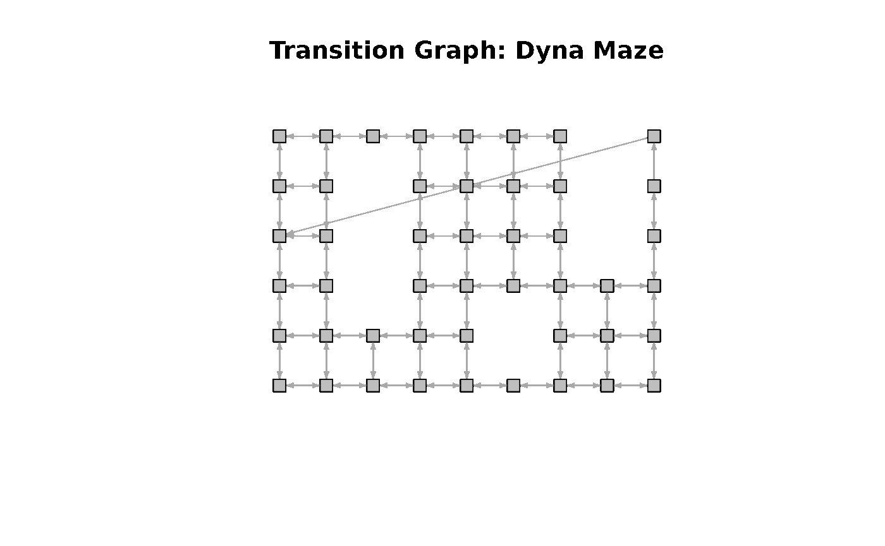
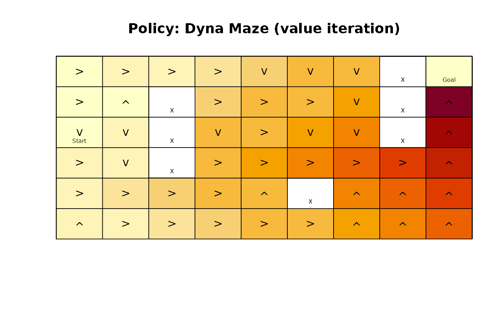
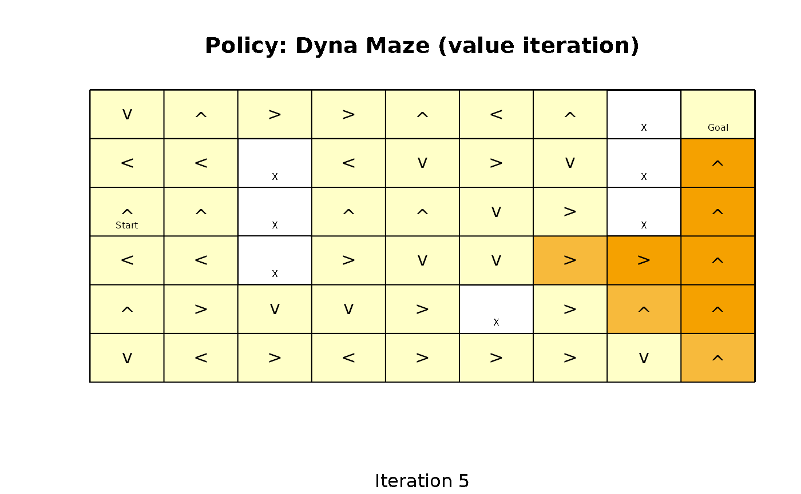
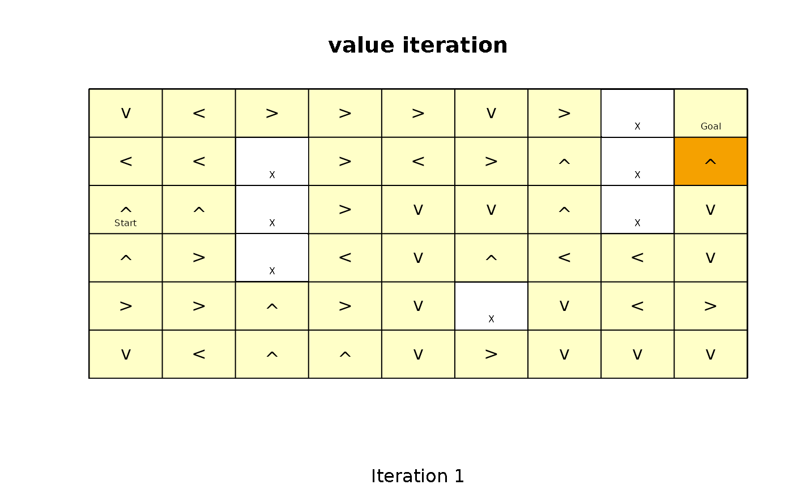
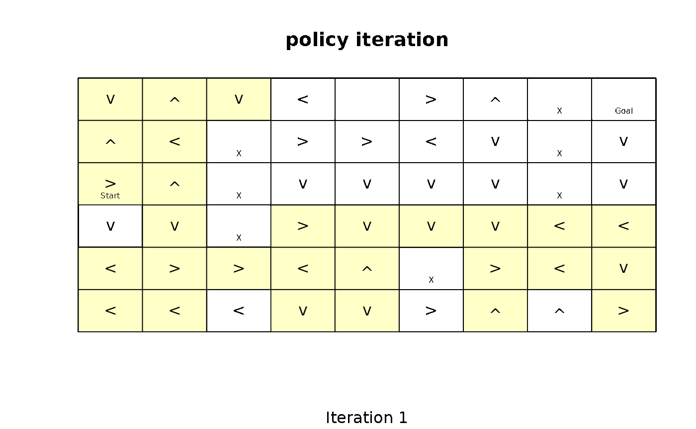
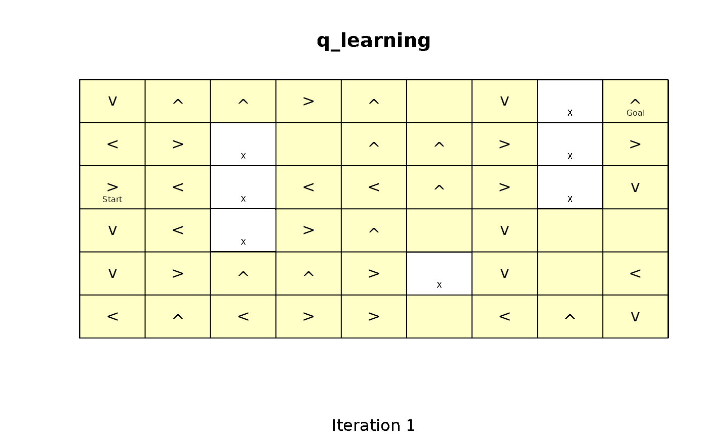
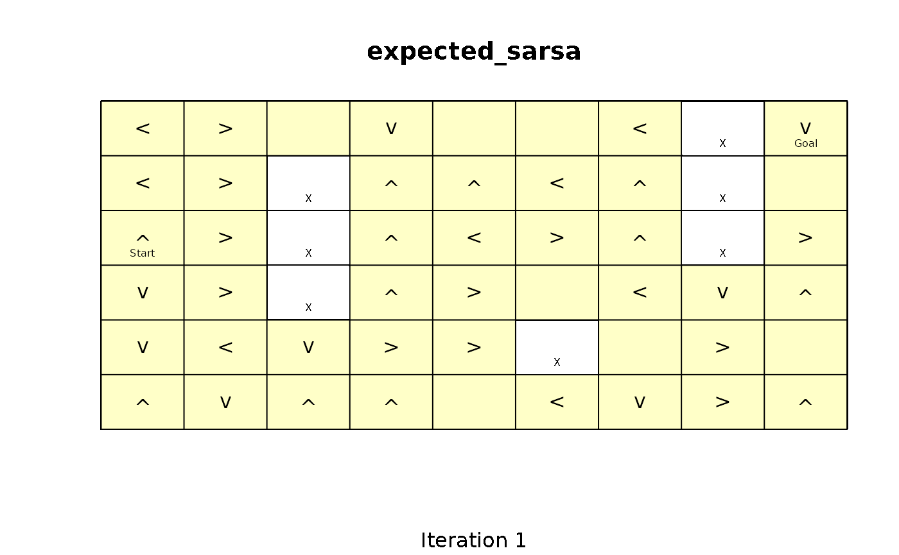

# Gridworlds in pomdp

``` r

library(pomdp)
```

## Introduction

Gridworlds represent an easy to explore how Markov Decision Problems
(MDPs), Partially Observable Decision Problems (POMDPs), and various
approaches to solve these problems work. The R package **pomdp**
(Hahsler and Cassandra 2025),(Hahsler 2025) provides a set of helper
functions starting with the prefix `gridworld_` to make defining and
experimenting with gridworlds easy.

## Defining a Gridworld

Many gridworlds represent mazes with start and goal states that the
agent needs to solve. Mazes can be easily defined. Here we create the
Dyna Maze from Chapter 8 in (Sutton and Barto 2018).

``` r

x <- gridworld_maze_MDP(
                dim = c(6,9),
                start = "s(3,1)",
                goal = "s(1,9)",
                walls = c("s(2,3)", "s(3,3)", "s(4,3)",
                          "s(5,6)",
                          "s(1,8)", "s(2,8)", "s(3,8)"),
                goal_reward = 1,
                step_cost = 0,
                restart = TRUE,
                discount = 0.95,
                name = "Dyna Maze",
                )
x
#> MDP, list - Dyna Maze
#>   Discount factor: 0.95
#>   Horizon: Inf epochs
#>   Size: 47 states / 5 actions
#>   Start: s(3,1)
#> 
#>   List components: 'name', 'discount', 'horizon', 'states', 'actions',
#>     'transition_prob', 'reward', 'info', 'start'
```

Gridworlds are implemented with state names `"s(<row>,<col>)"`, where
`row` and `col` are locations in the matrix representing the gridworld.
The actions are `"up"`, `"right"`, `"down"`, and `"left"`. Conversion
between state labels and the position in the matrix (row and column
index) can be done with
[`gridworld_s2rc()`](http://michael.hahsler.net/pomdp/reference/gridworld.md)
and
[`gridworld_rc2s()`](http://michael.hahsler.net/pomdp/reference/gridworld.md),
respectively.

The transition graph can be visualized. Note, the transition from the
state below the goal state back to the start state shows that the maze
restarts the agent once it reaches the goal and collects the goal
reward.

``` r

gridworld_plot_transition_graph(x)
```



A more general way to create gridworlds is implemented in the function
[`gridworld_init()`](http://michael.hahsler.net/pomdp/reference/gridworld.md)
which initializes a new gridworld creating a matrix of states with given
dimensions. Unreachable states and absorbing states can be defined. The
returned information can be used to build a custom gridworld MDP.

## Working with Gridworld MDPs

The gridworld can be accessed as a matrix.

``` r

gridworld_matrix(x)
#>      [,1]     [,2]     [,3]     [,4]     [,5]     [,6]     [,7]     [,8]    
#> [1,] "s(1,1)" "s(1,2)" "s(1,3)" "s(1,4)" "s(1,5)" "s(1,6)" "s(1,7)" NA      
#> [2,] "s(2,1)" "s(2,2)" NA       "s(2,4)" "s(2,5)" "s(2,6)" "s(2,7)" NA      
#> [3,] "s(3,1)" "s(3,2)" NA       "s(3,4)" "s(3,5)" "s(3,6)" "s(3,7)" NA      
#> [4,] "s(4,1)" "s(4,2)" NA       "s(4,4)" "s(4,5)" "s(4,6)" "s(4,7)" "s(4,8)"
#> [5,] "s(5,1)" "s(5,2)" "s(5,3)" "s(5,4)" "s(5,5)" NA       "s(5,7)" "s(5,8)"
#> [6,] "s(6,1)" "s(6,2)" "s(6,3)" "s(6,4)" "s(6,5)" "s(6,6)" "s(6,7)" "s(6,8)"
#>      [,9]    
#> [1,] "s(1,9)"
#> [2,] "s(2,9)"
#> [3,] "s(3,9)"
#> [4,] "s(4,9)"
#> [5,] "s(5,9)"
#> [6,] "s(6,9)"
gridworld_matrix(x, what = "labels")
#>      [,1]    [,2] [,3] [,4] [,5] [,6] [,7] [,8] [,9]  
#> [1,] ""      ""   ""   ""   ""   ""   ""   "X"  "Goal"
#> [2,] ""      ""   "X"  ""   ""   ""   ""   "X"  ""    
#> [3,] "Start" ""   "X"  ""   ""   ""   ""   "X"  ""    
#> [4,] ""      ""   "X"  ""   ""   ""   ""   ""   ""    
#> [5,] ""      ""   ""   ""   ""   "X"  ""   ""   ""    
#> [6,] ""      ""   ""   ""   ""   ""   ""   ""   ""
gridworld_matrix(x, what = "reachable")
#>      [,1] [,2]  [,3] [,4] [,5]  [,6] [,7]  [,8] [,9]
#> [1,] TRUE TRUE  TRUE TRUE TRUE  TRUE TRUE FALSE TRUE
#> [2,] TRUE TRUE FALSE TRUE TRUE  TRUE TRUE FALSE TRUE
#> [3,] TRUE TRUE FALSE TRUE TRUE  TRUE TRUE FALSE TRUE
#> [4,] TRUE TRUE FALSE TRUE TRUE  TRUE TRUE  TRUE TRUE
#> [5,] TRUE TRUE  TRUE TRUE TRUE FALSE TRUE  TRUE TRUE
#> [6,] TRUE TRUE  TRUE TRUE TRUE  TRUE TRUE  TRUE TRUE
```

Other options for `what` are `"values"` (for state values) and
`"action"`, but these are only available for solved problems that
contain a policy.

## Solving a Gridworld

Gridworld MDPs are solved like any other MDP.

``` r

sol <- solve_MDP(x, method = "value_iteration")
sol
#> MDP, list - Dyna Maze
#>   Discount factor: 0.95
#>   Horizon: Inf epochs
#>   Size: 47 states / 5 actions
#>   Start: s(3,1)
#>   Solved:
#>     Method: 'value iteration'
#>     Solution converged: TRUE
#> 
#>   List components: 'name', 'discount', 'horizon', 'states', 'actions',
#>     'transition_prob', 'reward', 'info', 'start', 'solution'
```

Detailed information about the solution can be accessed.

``` r

sol$solution
#> $method
#> [1] "value iteration"
#> 
#> $policy
#> $policy[[1]]
#>     state         U  action
#> 1  s(1,1) 0.9560273   right
#> 2  s(2,1) 0.9077464   right
#> 3  s(3,1) 0.9560273    down
#> 4  s(4,1) 1.0063445   right
#> 5  s(5,1) 1.0593100   right
#> 6  s(6,1) 1.0063445      up
#> 7  s(1,2) 1.0063445   right
#> 8  s(2,2) 0.9560273      up
#> 9  s(3,2) 1.0063445    down
#> 10 s(4,2) 1.0593100    down
#> 11 s(5,2) 1.1150632   right
#> 12 s(6,2) 1.0593100   right
#> 13 s(1,3) 1.0593100   right
#> 14 s(5,3) 1.1737507   right
#> 15 s(6,3) 1.1150632   right
#> 16 s(1,4) 1.1150632   right
#> 17 s(2,4) 1.1737507   right
#> 18 s(3,4) 1.2355271    down
#> 19 s(4,4) 1.3005548   right
#> 20 s(5,4) 1.2355271   right
#> 21 s(6,4) 1.1737507   right
#> 22 s(1,5) 1.1737507    down
#> 23 s(2,5) 1.2355271   right
#> 24 s(3,5) 1.3005548   right
#> 25 s(4,5) 1.3690050   right
#> 26 s(5,5) 1.3005548      up
#> 27 s(6,5) 1.2355271   right
#> 28 s(1,6) 1.2355271    down
#> 29 s(2,6) 1.3005548   right
#> 30 s(3,6) 1.3690050    down
#> 31 s(4,6) 1.4410579   right
#> 32 s(6,6) 1.3005548   right
#> 33 s(1,7) 1.3005548    down
#> 34 s(2,7) 1.3690050    down
#> 35 s(3,7) 1.4410579    down
#> 36 s(4,7) 1.5169031   right
#> 37 s(5,7) 1.4410579      up
#> 38 s(6,7) 1.3690050      up
#> 39 s(4,8) 1.5967401   right
#> 40 s(5,8) 1.5169031      up
#> 41 s(6,8) 1.4410579      up
#> 42 s(1,9) 0.9077464 restart
#> 43 s(2,9) 1.8623591      up
#> 44 s(3,9) 1.7692411      up
#> 45 s(4,9) 1.6807791      up
#> 46 s(5,9) 1.5967401      up
#> 47 s(6,9) 1.5169031      up
#> 
#> 
#> $converged
#> [1] TRUE
#> 
#> $delta
#> [1] 0.0005047701
#> 
#> $iterations
#> [1] 149
```

Now the policy and the state values are available as a matrix.

``` r

gridworld_matrix(sol, what = "values")
#>           [,1]      [,2]     [,3]     [,4]     [,5]     [,6]     [,7]     [,8]
#> [1,] 0.9560273 1.0063445 1.059310 1.115063 1.173751 1.235527 1.300555       NA
#> [2,] 0.9077464 0.9560273       NA 1.173751 1.235527 1.300555 1.369005       NA
#> [3,] 0.9560273 1.0063445       NA 1.235527 1.300555 1.369005 1.441058       NA
#> [4,] 1.0063445 1.0593100       NA 1.300555 1.369005 1.441058 1.516903 1.596740
#> [5,] 1.0593100 1.1150632 1.173751 1.235527 1.300555       NA 1.441058 1.516903
#> [6,] 1.0063445 1.0593100 1.115063 1.173751 1.235527 1.300555 1.369005 1.441058
#>           [,9]
#> [1,] 0.9077464
#> [2,] 1.8623591
#> [3,] 1.7692411
#> [4,] 1.6807791
#> [5,] 1.5967401
#> [6,] 1.5169031
gridworld_matrix(sol, what = "actions")
#>      [,1]    [,2]    [,3]    [,4]    [,5]    [,6]    [,7]    [,8]    [,9]     
#> [1,] "right" "right" "right" "right" "down"  "down"  "down"  NA      "restart"
#> [2,] "right" "up"    NA      "right" "right" "right" "down"  NA      "up"     
#> [3,] "down"  "down"  NA      "down"  "right" "down"  "down"  NA      "up"     
#> [4,] "right" "down"  NA      "right" "right" "right" "right" "right" "up"     
#> [5,] "right" "right" "right" "right" "up"    NA      "up"    "up"    "up"     
#> [6,] "up"    "right" "right" "right" "right" "right" "up"    "up"    "up"
```

A visual presentation with the state value represented by color (darker
is larger), the policy represented by action arrows, and the labels
added is also available.

``` r

gridworld_plot_policy(sol)
```



We see that value iteration found a clear path from the start state
towards the goal state following increasing state values.

## Experimenting with Solvers

It is interesting to look how different solvers find a solution. We can
visualize how the policy and state values change after each iteration.
For example, we can stop the algorithm after a given number of
iterations and visualize the progress.

``` r

sol <- solve_MDP(x, method = "value_iteration", N = 5)
#> Warning in MDP_value_iteration_inf_horizon(model, error, N_max, U = U, verbose
#> = verbose): MDP solver did not converge after 5 iterations (delta =
#> 0.81450625). Consider decreasing the 'discount' factor or increasing 'error' or
#> 'N_max'.
gridworld_plot_policy(sol, zlim = c(0, 2), sub = "Iteration 5")
```

 The solver
creates a warning indicating that the solution has not converged after
only 5 iterations. In the visualization, we see that value iteration has
expanded values from the goal state up to 5 squares away. To make this
analysis easier, we can use
[`gridworld_animate()`](http://michael.hahsler.net/pomdp/reference/gridworld.md)
to draw a visualization after each iteration.

``` r

gridworld_animate(x, "value_iteration", n = 5, zlim = c(0, 2))
```

 When `gifski` is
installed, R Markdown combines the individual frames into an animation.
Otherwise, the vignette displays the final frame as a static plot.

``` r

gridworld_animate(x, "value_iteration", n = 20, zlim = c(0, 2))
```


It is easy to see how value iteration propagates value from the goal to
the start. In the following, we create animations for more solving
methods.

``` r

gridworld_animate(x, "policy_iteration", n = 20, zlim = c(0, 2))
```



``` r

gridworld_animate(x, "q_learning", n = 20, zlim = c(0, 2),  horizon = 100)
```



``` r

gridworld_animate(x, "sarsa", n = 20, zlim = c(0, 2), horizon = 100)
```


``` r

gridworld_animate(x, "expected_sarsa", n = 20, zlim = c(0, 2), horizon = 100, alpha = 1)
```



Hahsler, Michael. 2025. *Pomdp: Infrastructure for Partially Observable
Markov Decision Processes (POMDP)*. <https://github.com/mhahsler/pomdp>.

Hahsler, Michael, and Anthony R. Cassandra. 2025. “Pomdp: A
Computational Infrastructure for Partially Observable Markov Decision
Processes.” *The R Journal* 16 (2): 116–33.
<https://doi.org/10.32614/RJ-2024-021>.

Sutton, Richard S., and Andrew G. Barto. 2018. *Reinforcement Learning:
An Introduction*. Second. The MIT Press.
