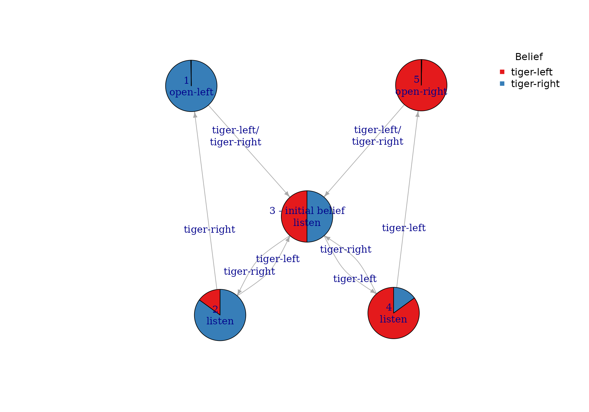
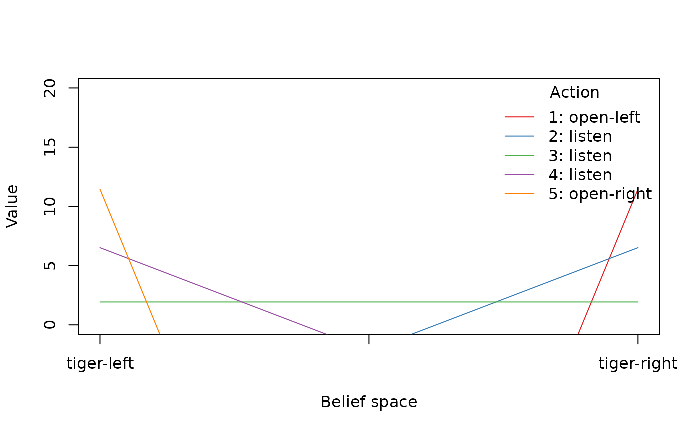

# Getting Started with pomdp

``` r

library("pomdp")
```

## Introduction

The R package **pomdp** (Hahsler and Cassandra 2025),(Hahsler 2025)
provides the infrastructure to define and analyze the solutions of
Partially Observable Markov Decision Processes (POMDP) models. The
package is a companion to package **pomdpSolve** which provides the
executable for ‘[pomdp-solve](http://www.pomdp.org/code/)’ (Cassandra
2015), a well-known fast C implementation of a variety of algorithms to
solve POMDPs. **pomdp** can also use package **sarsop** (Boettiger et
al. 2021) which provides an implementation of the SARSOP (Successive
Approximations of the Reachable Space under Optimal Policies) algorithm.

The package provides the following algorithms:

- Exact value iteration

  - **Enumeration algorithm** (Sondik 1971).
  - **Two pass algorithm** (Sondik 1971).
  - **Witness algorithm** (Littman et al. 1995).
  - **Incremental pruning algorithm** (Zhang and Liu 1996), (Cassandra
    et al. 1997).

- Approximate value iteration

  - **Finite grid algorithm** (Cassandra 2015), a variation of
    point-based value iteration to solve larger POMDPs (**PBVI**; see
    (Pineau et al. 2003)) without dynamic belief set expansion.
  - **SARSOP** (Kurniawati et al. 2008), Successive Approximations of
    the Reachable Space under Optimal Policies, a point-based algorithm
    that approximates optimally reachable belief spaces for
    infinite-horizon problems (via package **sarsop** (Boettiger et al.
    2021)).

The package enables the user to simply define all components of a POMDP
model and solve the problem using several methods. The package also
contains functions to analyze and visualize the POMDP solutions (e.g.,
the optimal policy) and extends to regular MDPs.

In this document, we will give a very brief introduction to the concept
of POMDPs, describe the features of the R package, and illustrate the
usage with a toy example.

## Partially Observable Markov Decision Processes

A partially observable Markov decision process (POMDP) is a combination
of an regular Markov Decision Process to model system dynamics with a
hidden Markov model that connects unobservable system states
probabilistically to observations.

The agent can perform actions which affect the system (i.e., may cause
the system state to change) with the goal to maximize the expected
future rewards that depend on the sequence of system state and the
agent’s actions in the future. The goal is to find the optimal policy
that guides the agent’s actions. Different to MDPs, for POMDPs, the
agent cannot directly observe the complete system state, but the agent
makes observations that depend on the state. The agent uses these
observations to form a belief about in what state the system currently
is. This belief is called a belief state and is expressed as a
probability distribution over all possible states. The solution of the
POMDP is a policy prescribing which action to take in each belief state.
Note that belief states are continuous resulting in an infinite state
set which makes POMDPs much harder to solve compared to MDPs.

The POMDP framework is general enough to model a variety of real-world
sequential decision-making problems. Applications include robot
navigation problems, machine maintenance, and planning under uncertainty
in general. The general framework of Markov decision processes with
incomplete information was described by Karl Johan Åström (Åström 1965)
in the case of a discrete state space, and it was further studied in the
operations research community where the acronym POMDP was coined. It was
later adapted for problems in artificial intelligence and automated
planning by Leslie P. Kaelbling and Michael L. Littman (Kaelbling et al.
1998).

A discrete-time POMDP can formally be described as a 7-tuple
``` math
\mathcal{P} = (S, A, T, R, \Omega , O, \gamma),
```
where

- $`S = \{s_1, s_2, \dots, s_n\}`$ is a set of partially observable
  states,

- $`A = \{a_1, a_2, \dots, a_m\}`$ is a set of actions,

- $`T`$ a set of conditional transition probabilities $`T(s' \mid s,a)`$
  for the state transition $`s \rightarrow s'`$ conditioned on the taken
  action.

- $`R: S \times A \rightarrow \mathbb{R}`$ is the reward function,

- $`\Omega = \{o_1, o_2, \dots, o_k\}`$ is a set of observations,

- $`O`$ is a set of observation probabilities $`O(o \mid s',a)`$
  conditioned on the reached state and the taken action, and

- $`\gamma \in [0, 1]`$ is the discount factor.

At each time period, the environment is in some unknown state
$`s \in S`$. The agent chooses an action $`a \in A`$, which causes the
environment to transition to state $`s' \in S`$ with probability
$`T(s' \mid s,a)`$. At the same time, the agent receives an observation
$`o \in \Omega`$ which depends on the new state of the environment with
probability $`O(o \mid s',a)`$. Finally, the agent receives a reward
$`R(s,a)`$. Then the process repeats. The goal is for the agent to
choose actions that maximizes the expected sum of discounted future
rewards, i.e., she chooses the actions at each time $`t`$ that
``` math
\max E\left[\sum_{t=0}^{\infty} \gamma^t R(s_t, a_t)\right].
```

For a finite time horizon, only the expectation over the sum up to the
time horizon is used.

## Package Functionality

Solving a POMDP problem with the **pomdp** package consists of two
steps:

1.  Define a POMDP problem using the function
    [`POMDP()`](http://michael.hahsler.net/pomdp/reference/POMDP.md),
    and  
2.  solve the problem using
    [`solve_POMDP()`](http://michael.hahsler.net/pomdp/reference/solve_POMDP.md).

### Defining a POMDP Problem

The [`POMDP()`](http://michael.hahsler.net/pomdp/reference/POMDP.md)
function has the following arguments, each of which corresponds to one
of the elements of a POMDP.

``` r

str(args(POMDP))
#> function (states, actions, observations, transition_prob, observation_prob, 
#>     reward, discount = 0.9, horizon = Inf, terminal_values = NULL, start = "uniform", 
#>     info = NULL, name = NA)
```

where

- `states` defines the set of states $`S`$,

- `actions` defines the set of actions $`A`$,

- `observations` defines the set of observations $`\Omega`$,

- `transition_prob` defines the conditional transition probabilities
  $`T(s' \mid s,a)`$,

- `observation_prob` specifies the conditional observation probabilities
  $`O(o \mid s',a)`$,

- `reward` specifies the reward function $`R`$,

- `discount` is the discount factor $`\gamma`$ in range $`[0,1]`$,

- `horizon` is the problem horizon as the number of periods to consider.

- `terminal_values` is a vector of state utilities at the end of the
  horizon.

- `start` is the initial probability distribution over the system states
  $`S`$,

- `max` indicates whether the problem is a maximization or a
  minimization, and

- `name` used to give the POMDP problem a name.

While specifying the discount rate and the set of states, observations
and actions is straightforward. Some arguments can be specified in
different ways. The initial belief state `start` can be specified as

- A vector of $`n`$ probabilities in $`[0,1]`$, that add up to 1, where
  $`n`$ is the number of states.

  ``` r

  start = c(0.5 , 0.3 , 0.2)
  ```

- The string ‘“uniform”’ for a uniform distribution over all states.

  ``` r

  start = "uniform"
  ```

- A vector of integer indices specifying a subset as start states. The
  initial probability is uniform over these states. For example, only
  state 3 or state 1 and 3:

  ``` r

  start = 3
  start = c(1, 3)
  ```

- A vector of strings specifying a subset as equally likely start
  states.

  ``` r

  start <- "state3"
  start <- c("state1" , "state3") 
  ```

- A vector of strings starting with `"-"` specifying which states to
  exclude from the uniform initial probability distribution.

  ``` r

  start = c("-" , "state2")
  ```

The transition probabilities (`transition_prob`), observation
probabilities (`observation_prob`) and reward function (`reward`) can be
specified in several ways:

- As a `data.frame` created using
  [`rbind()`](https://rdrr.io/r/base/cbind.html) and the helper
  functions
  [`T_()`](http://michael.hahsler.net/pomdp/reference/POMDP.md),
  [`O_()`](http://michael.hahsler.net/pomdp/reference/POMDP.md) and
  [`R_()`](http://michael.hahsler.net/pomdp/reference/POMDP.md).
- A named list of matrices representing the transition probabilities or
  rewards.
- A function with the same arguments
  [`T_()`](http://michael.hahsler.net/pomdp/reference/POMDP.md),
  [`O_()`](http://michael.hahsler.net/pomdp/reference/POMDP.md) or
  [`R_()`](http://michael.hahsler.net/pomdp/reference/POMDP.md) that
  returns the probability or reward.

More details can be found in the manual page for
[`POMDP()`](http://michael.hahsler.net/pomdp/reference/POMDP.md).

### Solving a POMDP

POMDP problems are solved with the function
[`solve_POMDP()`](http://michael.hahsler.net/pomdp/reference/solve_POMDP.md)
with the following arguments.

``` r

str(args(solve_POMDP))
#> function (model, horizon = NULL, discount = NULL, initial_belief = NULL, 
#>     terminal_values = NULL, method = "grid", digits = 7, parameter = NULL, 
#>     timeout = Inf, verbose = FALSE)
```

The `model` argument is a POMDP problem created using the
[`POMDP()`](http://michael.hahsler.net/pomdp/reference/POMDP.md)
function, but it can also be the name of a POMDP file using the format
described in the [file specification section of
’pomdp-solve](http://www.pomdp.org/code/pomdp-file-spec.md)’. The
`horizon` argument specifies the finite time horizon (i.e, the number of
time steps) considered in solving the problem. If the horizon is
unspecified (i.e., `NULL`), then the algorithm continues running
iterations till it converges to the infinite horizon solution. The
`method` argument specifies what algorithm the solver should use.
Available methods including `"grid"`, `"enum"`, `"twopass"`,
`"witness"`, and `"incprune"`. Further solver parameters can be
specified as a list in `parameters`. The list of available parameters
can be obtained using the function
[`solve_POMDP_parameter()`](http://michael.hahsler.net/pomdp/reference/solve_POMDP.md).
Details on the other arguments can be found in the manual page for
\`solve_POMDP()\`.

## The Tiger Problem Example

We will demonstrate how to use the package with the Tiger Problem
(Cassandra et al. 1994). The problem is defined as:

> An agent is facing two closed doors and a tiger is put with equal
> probability behind one of the two doors represented by the states
> `tiger-left` and `tiger-right`, while treasure is put behind the other
> door. The possible actions are `listen` for tiger noises or opening a
> door (actions `open-left` and `open-right`). Listening is neither free
> (the action has a reward of -1) nor is it entirely accurate. There is
> a 15% probability that the agent hears the tiger behind the left door
> while it is actually behind the right door and vice versa. If the
> agent opens door with the tiger, it will get hurt (a negative reward
> of -100), but if it opens the door with the treasure, it will receive
> a positive reward of 10. After a door is opened, the problem is reset
> (i.e., the tiger is randomly assigned to a door with a 50/50 chance),
> and the agent gets another try.

### Specifying the Tiger Problem

The problem can be specified using the
[`POMDP()`](http://michael.hahsler.net/pomdp/reference/POMDP.md)
function as follows.

``` r

library("pomdp")

Tiger <- POMDP(
  name = "Tiger Problem",
  
  discount = 0.75,
  
  states = c("tiger-left" , "tiger-right"),
  actions = c("listen", "open-left", "open-right"),
  observations = c("tiger-left", "tiger-right"),
  
  start = "uniform",
  
  transition_prob = list(
    "listen" = "identity", 
    "open-left" = "uniform", 
    "open-right" = "uniform"),

  observation_prob = list(
    "listen" = matrix(c(0.85, 0.15, 0.15, 0.85), nrow = 2, byrow = TRUE), 
    "open-left" = "uniform",
    "open-right" = "uniform"),
    
  reward = rbind(
    R_("listen",     "*",           "*", "*", -1  ),
    R_("open-left",  "tiger-left",  "*", "*", -100),
    R_("open-left",  "tiger-right", "*", "*", 10  ),
    R_("open-right", "tiger-left",  "*", "*", 10  ),
    R_("open-right", "tiger-right", "*", "*", -100)
  )
)

Tiger
#> POMDP, list - Tiger Problem
#>   Discount factor: 0.75
#>   Horizon: Inf epochs
#>   Size: 2 states / 3 actions / 2 obs.
#>   Start: uniform
#>   Solved: FALSE
#> 
#>   List components: 'name', 'discount', 'horizon', 'states', 'actions',
#>     'observations', 'transition_prob', 'observation_prob', 'reward',
#>     'start', 'terminal_values', 'info'
```

Note that we use for each component the way that lets us specify the
problem in the easiest way (i.e., for observations and transitions a
list and for rewards a data frame created with the
[`R_()`](http://michael.hahsler.net/pomdp/reference/POMDP.md) function).

### Solving the Tiger Problem

Now, we can solve the problem. We use the default method (finite grid)
which implements a form of point-based value iteration that can find
approximate solutions also for larger problems.

``` r

sol <- solve_POMDP(Tiger)
sol
#> POMDP, list - Tiger Problem
#>   Discount factor: 0.75
#>   Horizon: Inf epochs
#>   Size: 2 states / 3 actions / 2 obs.
#>   Start: uniform
#>   Solved:
#>     Method: 'grid'
#>     Solution converged: TRUE
#>     # of alpha vectors: 5
#>     Total expected reward: 1.933439
#> 
#>   List components: 'name', 'discount', 'horizon', 'states', 'actions',
#>     'observations', 'transition_prob', 'observation_prob', 'reward',
#>     'start', 'info', 'solution'
```

The output is an object of class POMDP which contains the solution as an
additional list component. The solution can be accessed directly in the
list.

``` r

sol$solution
#> POMDP solution
#> 
#> $method
#> [1] "grid"
#> 
#> $parameter
#> NULL
#> 
#> $converged
#> [1] TRUE
#> 
#> $total_expected_reward
#> [1] 1.933439
#> 
#> $initial_belief
#>  tiger-left tiger-right 
#>         0.5         0.5 
#> 
#> $initial_pg_node
#> [1] 3
#> 
#> $belief_points_solver
#>         tiger-left  tiger-right
#>  [1,] 5.000000e-01 5.000000e-01
#>  [2,] 8.500000e-01 1.500000e-01
#>  [3,] 1.500000e-01 8.500000e-01
#>  [4,] 9.697987e-01 3.020134e-02
#>  [5,] 3.020134e-02 9.697987e-01
#>  [6,] 9.945344e-01 5.465587e-03
#>  [7,] 5.465587e-03 9.945344e-01
#>  [8,] 9.990311e-01 9.688763e-04
#>  [9,] 9.688763e-04 9.990311e-01
#> [10,] 9.998289e-01 1.711147e-04
#> [11,] 1.711147e-04 9.998289e-01
#> [12,] 9.999698e-01 3.020097e-05
#> [13,] 3.020097e-05 9.999698e-01
#> [14,] 9.999947e-01 5.329715e-06
#> [15,] 5.329715e-06 9.999947e-01
#> [16,] 9.999991e-01 9.405421e-07
#> [17,] 9.405421e-07 9.999991e-01
#> [18,] 9.999998e-01 1.659782e-07
#> [19,] 1.659782e-07 9.999998e-01
#> [20,] 1.000000e+00 2.929027e-08
#> [21,] 2.929027e-08 1.000000e+00
#> [22,] 1.000000e+00 5.168871e-09
#> [23,] 5.168871e-09 1.000000e+00
#> [24,] 1.000000e+00 9.121536e-10
#> [25,] 9.121536e-10 1.000000e+00
#> 
#> $pg
#> $pg[[1]]
#>   node     action tiger-left tiger-right
#> 1    1  open-left          3           3
#> 2    2     listen          3           1
#> 3    3     listen          4           2
#> 4    4     listen          5           3
#> 5    5 open-right          3           3
#> 
#> 
#> $alpha
#> $alpha[[1]]
#>      tiger-left tiger-right
#> [1,] -98.549921   11.450079
#> [2,] -10.854299    6.516937
#> [3,]   1.933439    1.933439
#> [4,]   6.516937  -10.854299
#> [5,]  11.450079  -98.549921
#> 
#> 
#> $solver_output
#> 0
#>  //****************\\
#> ||   pomdp-solve    ||
#> || v. 5.3 (R-mod) ||
#>  \\****************//
#> - - - - - - - - - - - - - - - - - - - -
#> time_limit = 0
#> force_rounding = false
#> mcgs_prune_freq = 100
#> verbose = context
#> stdout = 
#> inc_prune = normal
#> history_length = 0
#> prune_epsilon = 0.000000
#> save_all = true
#> o = /tmp/RtmpOvZR6d/pomdp_1dff24d49f22-0
#> fg_save = true
#> enum_purge = normal_prune
#> fg_type = initial
#> fg_epsilon = 0.000000
#> mcgs_traj_iter_count = 1
#> lp_epsilon = 0.000000
#> end_epsilon = 0.000000
#> start_epsilon = 0.000000
#> dom_check = false
#> stop_delta = 0.000000
#> q_purge = normal_prune
#> pomdp = /tmp/RtmpOvZR6d/pomdp_1dff24d49f22.POMDP
#> mcgs_num_traj = 1000
#> stop_criteria = weak
#> method = grid
#> memory_limit = 0
#> alg_rand = 0
#> terminal_values = 
#> save_penultimate = false
#> epsilon = 0.000000
#> rand_seed = 
#> discount = 0.750000
#> fg_points = 10000
#> fg_purge = normal_prune
#> fg_nonneg_rewards = false
#> proj_purge = normal_prune
#> mcgs_traj_length = 100
#> history_delta = 0
#> f = 
#> epsilon_adjust = 0.000000
#> grid_filename = 
#> prune_rand = 0
#> vi_variation = normal
#> horizon = 0
#> stat_summary = false
#> max_soln_size = 0.000000
#> witness_points = false
#> - - - - - - - - - - - - - - - - - - - -
#> [Initializing POMDP ... done.]
#> [Finite Grid Method:]
#>     [Creating grid ... done.]
#>     [Grid has 25 points.]
#>     Grid saved to /tmp/RtmpOvZR6d/pomdp_1dff24d49f22-0.belief.
#> The initial policy being used:
#> Alpha List: Length=1
#> <id=0: a=0> 
#> ++++++++++++++++++++++++++++++++++++++++
#> Epoch: 1...3 vectors (delta=1.10e+02)
#> Epoch: 2...5 vectors (delta=7.85e+01)
#> Epoch: 3...5 vectors (delta=5.89e+01)
#> Epoch: 4...5 vectors (delta=4.42e+01)
#> Epoch: 5...5 vectors (delta=3.27e+01)
#> Epoch: 6...5 vectors (delta=2.45e+01)
#> Epoch: 7...5 vectors (delta=1.84e+01)
#> Epoch: 8...5 vectors (delta=1.37e+01)
#> Epoch: 9...5 vectors (delta=1.02e+01)
#> Epoch: 10...5 vectors (delta=7.68e+00)
#> Epoch: 11...5 vectors (delta=5.72e+00)
#> Epoch: 12...5 vectors (delta=4.29e+00)
#> Epoch: 13...5 vectors (delta=3.22e+00)
#> Epoch: 14...5 vectors (delta=2.41e+00)
#> Epoch: 15...5 vectors (delta=1.81e+00)
#> Epoch: 16...5 vectors (delta=1.36e+00)
#> Epoch: 17...5 vectors (delta=1.02e+00)
#> Epoch: 18...5 vectors (delta=7.63e-01)
#> Epoch: 19...5 vectors (delta=5.71e-01)
#> Epoch: 20...5 vectors (delta=4.29e-01)
#> Epoch: 21...5 vectors (delta=3.21e-01)
#> Epoch: 22...5 vectors (delta=2.41e-01)
#> Epoch: 23...5 vectors (delta=1.81e-01)
#> Epoch: 24...5 vectors (delta=1.35e-01)
#> Epoch: 25...5 vectors (delta=1.02e-01)
#> Epoch: 26...5 vectors (delta=7.62e-02)
#> Epoch: 27...5 vectors (delta=5.71e-02)
#> Epoch: 28...5 vectors (delta=4.28e-02)
#> Epoch: 29...5 vectors (delta=3.21e-02)
#> Epoch: 30...5 vectors (delta=2.41e-02)
#> Epoch: 31...5 vectors (delta=1.81e-02)
#> Epoch: 32...5 vectors (delta=1.35e-02)
#> Epoch: 33...5 vectors (delta=1.02e-02)
#> Epoch: 34...5 vectors (delta=7.62e-03)
#> Epoch: 35...5 vectors (delta=5.71e-03)
#> Epoch: 36...5 vectors (delta=4.28e-03)
#> Epoch: 37...5 vectors (delta=3.21e-03)
#> Epoch: 38...5 vectors (delta=2.41e-03)
#> Epoch: 39...5 vectors (delta=1.81e-03)
#> Epoch: 40...5 vectors (delta=1.36e-03)
#> Epoch: 41...5 vectors (delta=1.02e-03)
#> Epoch: 42...5 vectors (delta=7.62e-04)
#> Epoch: 43...5 vectors (delta=5.72e-04)
#> Epoch: 44...5 vectors (delta=4.29e-04)
#> Epoch: 45...5 vectors (delta=3.22e-04)
#> Epoch: 46...5 vectors (delta=2.41e-04)
#> Epoch: 47...5 vectors (delta=1.81e-04)
#> Epoch: 48...5 vectors (delta=1.36e-04)
#> Epoch: 49...5 vectors (delta=1.02e-04)
#> Epoch: 50...5 vectors (delta=7.63e-05)
#> Epoch: 51...5 vectors (delta=5.72e-05)
#> Epoch: 52...5 vectors (delta=4.29e-05)
#> Epoch: 53...5 vectors (delta=3.22e-05)
#> Epoch: 54...5 vectors (delta=2.42e-05)
#> Epoch: 55...5 vectors (delta=1.81e-05)
#> Epoch: 56...5 vectors (delta=1.36e-05)
#> Epoch: 57...5 vectors (delta=1.02e-05)
#> Epoch: 58...5 vectors (delta=7.64e-06)
#> Epoch: 59...5 vectors (delta=5.73e-06)
#> Epoch: 60...5 vectors (delta=4.30e-06)
#> Epoch: 61...5 vectors (delta=3.22e-06)
#> Epoch: 62...5 vectors (delta=2.42e-06)
#> Epoch: 63...5 vectors (delta=1.81e-06)
#> Epoch: 64...5 vectors (delta=1.36e-06)
#> Epoch: 65...5 vectors (delta=1.02e-06)
#> Epoch: 66...5 vectors (delta=7.65e-07)
#> Epoch: 67...5 vectors (delta=5.74e-07)
#> Epoch: 68...5 vectors (delta=4.30e-07)
#> Epoch: 69...5 vectors (delta=3.23e-07)
#> Epoch: 70...5 vectors (delta=2.42e-07)
#> Epoch: 71...5 vectors (delta=1.82e-07)
#> Epoch: 72...5 vectors (delta=1.36e-07)
#> Epoch: 73...5 vectors (delta=1.02e-07)
#> Epoch: 74...5 vectors (delta=7.66e-08)
#> Epoch: 75...5 vectors (delta=5.74e-08)
#> Epoch: 76...5 vectors (delta=4.31e-08)
#> Epoch: 77...5 vectors (delta=3.23e-08)
#> Epoch: 78...5 vectors (delta=2.42e-08)
#> Epoch: 79...5 vectors (delta=1.82e-08)
#> Epoch: 80...5 vectors (delta=1.36e-08)
#> Epoch: 81...5 vectors (delta=1.02e-08)
#> Epoch: 82...5 vectors (delta=7.67e-09)
#> Epoch: 83...5 vectors (delta=5.75e-09)
#> Epoch: 84...5 vectors (delta=4.31e-09)
#> Epoch: 85...5 vectors (delta=3.23e-09)
#> Epoch: 86...5 vectors (delta=2.43e-09)
#> Epoch: 87...5 vectors (delta=1.82e-09)
#> Epoch: 88...5 vectors (delta=1.36e-09)
#> Epoch: 89...5 vectors (delta=1.02e-09)
#> Epoch: 90...5 vectors (delta=0.00e+00)
#> ++++++++++++++++++++++++++++++++++++++++
#> Solution found.  See file:
#>  /tmp/RtmpOvZR6d/pomdp_1dff24d49f22-0.alpha
#>  /tmp/RtmpOvZR6d/pomdp_1dff24d49f22-0.pg
#> ++++++++++++++++++++++++++++++++++++++++
#> 
#> 
#> FALSE
```

The solution contains the following elements:

- **`total_expected_reward`:** The total expected reward of the optimal
  solution.

- **`initial_belief_state`:** The index of the node in the policy graph
  that represents the initial belief state.

- **`belief_states`:** A data frame of all the belief states (rows) used
  while solving the problem. There is a column at the end that indicates
  which node in the policy graph is associated with the belief state.
  That is which segment in the value function (specified in **alpha**
  below) provides the best value for the given belief state.

- **`pg`:** A data frame containing the optimal policy graph. Rows are
  nodes in the graph are segments in the value function and each
  represents one or more belief states. Column two indicates the optimal
  action for the node. Columns three and after represent the transitions
  to new nodes in the policy graph depending on the next observation.

- **`alpha`:** A data frame with the coefficients of the optimal
  hyperplanes for the value function.

- **`policy`:** A data frame that combines the information from `pg` and
  `alpha`. The first few columns specifying the belief state (hyperplane
  from `alpha`) and the last column indicates the optimal action (from
  `pg`).

### Visualization

In this section, we will visualize the policy graph provided in the
solution by the
[`solve_POMDP()`](http://michael.hahsler.net/pomdp/reference/solve_POMDP.md)
function.

``` r

plot_policy_graph(sol)
```



The policy graph can be easily interpreted. Without prior information,
the agent starts at the node marked with “initial belief.” In this case
the agent beliefs that there is a 50-50 chance that the tiger is behind
ether door. The optimal action is displayed inside the state and in this
case is to listen. The observations are labels on the arcs. Let us
assume that the observation is “tiger-left”, then the agent follows the
appropriate arc and ends in a node representing a belief (one ore more
belief states) that has a very high probability of the tiger being left.
However, the optimal action is still to listen. If the agent again hears
the tiger on the left then it ends up in a note that has a close to 100%
belief that the tiger is to the left and `open-right` is the optimal
action. The are arcs back from the nodes with the open actions to the
initial state reset the problem.

Since we only have two states, we can visualize the piecewise linear
convex value function as a simple plot.

``` r

alpha <- sol$solution$alpha
alpha
#> [[1]]
#>      tiger-left tiger-right
#> [1,] -98.549921   11.450079
#> [2,] -10.854299    6.516937
#> [3,]   1.933439    1.933439
#> [4,]   6.516937  -10.854299
#> [5,]  11.450079  -98.549921

plot_value_function(sol, ylim = c(0,20))
```



The lines represent the nodes in the policy graph and the optimal
actions are shown in the legend.

## References

Åström, K. J. 1965. “Optimal Control of Markov Processes with Incomplete
State Information.” *Journal of Mathematical Analysis and Applications*
10 (1): 174–205.

Boettiger, Carl, Jeroen Ooms, and Milad Memarzadeh. 2021. *Sarsop:
Approximate POMDP Planning Software*.
<https://CRAN.R-project.org/package=sarsop>.

Cassandra, Anthony R. 2015. *The POMDP Page*. <https://www.pomdp.org>.

Cassandra, Anthony R., Leslie Pack Kaelbling, and Michael L. Littman.
1994. “Acting Optimally in Partially Observable Stochastic Domains.”
*Proceedings of the Twelfth National Conference on Artificial
Intelligence* (Seattle, WA).

Cassandra, Anthony R., Michael L. Littman, and Nevin Lianwen Zhang.
1997. “Incremental Pruning: A Simple, Fast, Exact Method for Partially
Observable Markov Decision Processes.” *UAI’97: Proceedings of the
Thirteenth Conference on Uncertainty in Artificial Intelligence*,
54--61.

Hahsler, Michael. 2025. *Pomdp: Infrastructure for Partially Observable
Markov Decision Processes (POMDP)*. <https://github.com/mhahsler/pomdp>.

Hahsler, Michael, and Anthony R. Cassandra. 2025. “Pomdp: A
Computational Infrastructure for Partially Observable Markov Decision
Processes.” *The R Journal* 16 (2): 116–33.
<https://doi.org/10.32614/RJ-2024-021>.

Kaelbling, Leslie Pack, Michael L. Littman, and Anthony R. Cassandra.
1998. “Planning and Acting in Partially Observable Stochastic Domains.”
*Artificial Intelligence* 101 (1): 99–134.
<https://doi.org/10.1016/S0004-3702(98)00023-X>.

Kurniawati, Hanna, David Hsu, and Wee Sun Lee. 2008. “SARSOP: Efficient
Point-Based POMDP Planning by Approximating Optimally Reachable Belief
Spaces.” *In Proc. Robotics: Science and Systems*.

Littman, Michael L., Anthony R. Cassandra, and Leslie Pack Kaelbling.
1995. “Learning Policies for Partially Observable Environments: Scaling
Up.” *Proceedings of the Twelfth International Conference on
International Conference on Machine Learning* (San Francisco, CA, USA),
ICML’95, 362–70.

Pineau, Joelle, Geoff Gordon, and Sebastian Thrun. 2003. “Point-Based
Value Iteration: An Anytime Algorithm for POMDPs.” *Proceedings of the
18th International Joint Conference on Artificial Intelligence* (San
Francisco, CA, USA), IJCAI’03, 1025–30.

Sondik, E. J. 1971. “The Optimal Control of Partially Observable Markov
Decision Processes.” PhD thesis, Stanford, California.

Zhang, Nevin L., and Wenju Liu. 1996. *Planning in Stochastic Domains:
Problem Characteristics and Approximation*. HKUST-CS96-31. Hong Kong
University.
