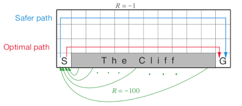

# Cliff Walking Gridworld MDP

The cliff walking gridworld MDP example from Chapter 6 of the textbook
"Reinforcement Learning: An Introduction."

## Format

An object of class
[MDP](http://michael.hahsler.net/pomdp/reference/MDP.md).

## Details

The cliff walking gridworld has the following layout:



The gridworld is represented as a 4 x 12 matrix of states. The states
are labeled with their x and y coordinates. The start state is in the
bottom left corner. Each action has a reward of -1, falling off the
cliff has a reward of -100 and returns the agent back to the start. The
episode is finished once the agent reaches the absorbing goal state in
the bottom right corner. No discounting is used (i.e., \\\gamma = 1\\).

## References

Richard S. Sutton and Andrew G. Barto (2018). Reinforcement Learning: An
Introduction Second Edition, MIT Press, Cambridge, MA.

## See also

Other MDP_examples:
[`DynaMaze`](http://michael.hahsler.net/pomdp/reference/DynaMaze.md),
[`MDP()`](http://michael.hahsler.net/pomdp/reference/MDP.md),
[`Maze`](http://michael.hahsler.net/pomdp/reference/Maze.md),
[`Windy_gridworld`](http://michael.hahsler.net/pomdp/reference/Windy_gridworld.md)

Other gridworld:
[`DynaMaze`](http://michael.hahsler.net/pomdp/reference/DynaMaze.md),
[`Maze`](http://michael.hahsler.net/pomdp/reference/Maze.md),
[`Windy_gridworld`](http://michael.hahsler.net/pomdp/reference/Windy_gridworld.md),
[`gridworld`](http://michael.hahsler.net/pomdp/reference/gridworld.md)

## Examples

``` r
data(Cliff_walking)
Cliff_walking
#> MDP, list - Cliff Walking Gridworld
#>   Discount factor: 1
#>   Horizon: Inf epochs
#>   Size: 38 states / 4 actions
#>   Start: s(4,1)
#> 
#>   List components: ‘name’, ‘discount’, ‘horizon’, ‘states’, ‘actions’,
#>     ‘transition_prob’, ‘reward’, ‘info’, ‘start’

gridworld_matrix(Cliff_walking)
#>      [,1]     [,2]     [,3]     [,4]     [,5]     [,6]     [,7]     [,8]    
#> [1,] "s(1,1)" "s(1,2)" "s(1,3)" "s(1,4)" "s(1,5)" "s(1,6)" "s(1,7)" "s(1,8)"
#> [2,] "s(2,1)" "s(2,2)" "s(2,3)" "s(2,4)" "s(2,5)" "s(2,6)" "s(2,7)" "s(2,8)"
#> [3,] "s(3,1)" "s(3,2)" "s(3,3)" "s(3,4)" "s(3,5)" "s(3,6)" "s(3,7)" "s(3,8)"
#> [4,] "s(4,1)" NA       NA       NA       NA       NA       NA       NA      
#>      [,9]     [,10]     [,11]     [,12]    
#> [1,] "s(1,9)" "s(1,10)" "s(1,11)" "s(1,12)"
#> [2,] "s(2,9)" "s(2,10)" "s(2,11)" "s(2,12)"
#> [3,] "s(3,9)" "s(3,10)" "s(3,11)" "s(3,12)"
#> [4,] NA       NA        NA        "s(4,12)"
gridworld_matrix(Cliff_walking, what = "labels")
#>      [,1]    [,2] [,3] [,4] [,5] [,6] [,7] [,8] [,9] [,10] [,11] [,12] 
#> [1,] ""      ""   ""   ""   ""   ""   ""   ""   ""   ""    ""    ""    
#> [2,] ""      ""   ""   ""   ""   ""   ""   ""   ""   ""    ""    ""    
#> [3,] ""      ""   ""   ""   ""   ""   ""   ""   ""   ""    ""    ""    
#> [4,] "Start" "X"  "X"  "X"  "X"  "X"  "X"  "X"  "X"  "X"   "X"   "Goal"

# The Goal is an absorbing state 
which(absorbing_states(Cliff_walking))
#> s(4,12) 
#>      38 

# visualize the transition graph
gridworld_plot_transition_graph(Cliff_walking)


# solve using different methods
sol <- solve_MDP(Cliff_walking) 
sol
#> MDP, list - Cliff Walking Gridworld
#>   Discount factor: 1
#>   Horizon: Inf epochs
#>   Size: 38 states / 4 actions
#>   Start: s(4,1)
#>   Solved:
#>     Method: ‘value iteration’
#>     Solution converged: TRUE
#> 
#>   List components: ‘name’, ‘discount’, ‘horizon’, ‘states’, ‘actions’,
#>     ‘transition_prob’, ‘reward’, ‘info’, ‘start’, ‘solution’
policy(sol)
#>      state   U action
#> 1   s(1,1) -14   down
#> 2   s(2,1) -13   down
#> 3   s(3,1) -12  right
#> 4   s(4,1) -13     up
#> 5   s(1,2) -13  right
#> 6   s(2,2) -12   down
#> 7   s(3,2) -11  right
#> 8   s(1,3) -12  right
#> 9   s(2,3) -11   down
#> 10  s(3,3) -10  right
#> 11  s(1,4) -11  right
#> 12  s(2,4) -10   down
#> 13  s(3,4)  -9  right
#> 14  s(1,5) -10  right
#> 15  s(2,5)  -9   down
#> 16  s(3,5)  -8  right
#> 17  s(1,6)  -9  right
#> 18  s(2,6)  -8   down
#> 19  s(3,6)  -7  right
#> 20  s(1,7)  -8   down
#> 21  s(2,7)  -7  right
#> 22  s(3,7)  -6  right
#> 23  s(1,8)  -7   down
#> 24  s(2,8)  -6   down
#> 25  s(3,8)  -5  right
#> 26  s(1,9)  -6  right
#> 27  s(2,9)  -5  right
#> 28  s(3,9)  -4  right
#> 29 s(1,10)  -5   down
#> 30 s(2,10)  -4   down
#> 31 s(3,10)  -3  right
#> 32 s(1,11)  -4   down
#> 33 s(2,11)  -3   down
#> 34 s(3,11)  -2  right
#> 35 s(1,12)  -3   down
#> 36 s(2,12)  -2   down
#> 37 s(3,12)  -1   down
#> 38 s(4,12)   0   left
gridworld_plot_policy(sol)


sol <- solve_MDP(Cliff_walking, method = "q_learning", N = 100) 
sol
#> MDP, list - Cliff Walking Gridworld
#>   Discount factor: 1
#>   Horizon: Inf epochs
#>   Size: 38 states / 4 actions
#>   Start: s(4,1)
#>   Solved:
#>     Method: ‘q_learning’
#>     Solution converged: NA
#> 
#>   List components: ‘name’, ‘discount’, ‘horizon’, ‘states’, ‘actions’,
#>     ‘transition_prob’, ‘reward’, ‘info’, ‘start’, ‘solution’
policy(sol)
#>      state          U action
#> 1   s(1,1) -11.007765  right
#> 2   s(2,1) -11.437735   down
#> 3   s(3,1) -12.000000  right
#> 4   s(4,1) -13.000000     up
#> 5   s(1,2) -10.565666   down
#> 6   s(2,2) -11.062304  right
#> 7   s(3,2) -11.000000  right
#> 8   s(1,3) -10.191020   left
#> 9   s(2,3) -10.256013  right
#> 10  s(3,3) -10.000000  right
#> 11  s(1,4)  -9.581794  right
#> 12  s(2,4)  -9.433782  right
#> 13  s(3,4)  -9.000000  right
#> 14  s(1,5)  -8.758576  right
#> 15  s(2,5)  -8.736604  right
#> 16  s(3,5)  -8.000000  right
#> 17  s(1,6)  -7.935757  right
#> 18  s(2,6)  -7.786146   left
#> 19  s(3,6)  -7.000000  right
#> 20  s(1,7)  -7.031466  right
#> 21  s(2,7)  -6.877923  right
#> 22  s(3,7)  -6.000000  right
#> 23  s(1,8)  -6.296215   down
#> 24  s(2,8)  -5.922116  right
#> 25  s(3,8)  -5.000000  right
#> 26  s(1,9)  -5.502661  right
#> 27  s(2,9)  -4.952676  right
#> 28  s(3,9)  -4.000000  right
#> 29 s(1,10)  -4.624817   left
#> 30 s(2,10)  -3.990246   down
#> 31 s(3,10)  -3.000000  right
#> 32 s(1,11)  -3.826406  right
#> 33 s(2,11)  -2.998893  right
#> 34 s(3,11)  -2.000000  right
#> 35 s(1,12)  -2.973196   down
#> 36 s(2,12)  -1.999969   down
#> 37 s(3,12)  -1.000000   down
#> 38 s(4,12)   0.000000  right
gridworld_plot_policy(sol)


sol <- solve_MDP(Cliff_walking, method = "sarsa", N = 100) 
sol
#> MDP, list - Cliff Walking Gridworld
#>   Discount factor: 1
#>   Horizon: Inf epochs
#>   Size: 38 states / 4 actions
#>   Start: s(4,1)
#>   Solved:
#>     Method: ‘sarsa’
#>     Solution converged: NA
#> 
#>   List components: ‘name’, ‘discount’, ‘horizon’, ‘states’, ‘actions’,
#>     ‘transition_prob’, ‘reward’, ‘info’, ‘start’, ‘solution’
policy(sol)
#>      state          U action
#> 1   s(1,1) -14.784002  right
#> 2   s(2,1) -15.551555  right
#> 3   s(3,1) -16.463513     up
#> 4   s(4,1) -17.765462     up
#> 5   s(1,2) -13.682173  right
#> 6   s(2,2) -14.607755     up
#> 7   s(3,2) -15.696257     up
#> 8   s(1,3) -13.051177  right
#> 9   s(2,3) -13.412251  right
#> 10  s(3,3) -14.278612     up
#> 11  s(1,4) -11.484535  right
#> 12  s(2,4) -12.484011     up
#> 13  s(3,4)  -8.886641  right
#> 14  s(1,5) -10.253962  right
#> 15  s(2,5) -10.393736  right
#> 16  s(3,5)  -7.445004   left
#> 17  s(1,6)  -9.450991  right
#> 18  s(2,6)  -8.406104  right
#> 19  s(3,6)  -9.933978     up
#> 20  s(1,7)  -8.453483  right
#> 21  s(2,7)  -7.639815  right
#> 22  s(3,7)  -7.398935     up
#> 23  s(1,8)  -7.250561  right
#> 24  s(2,8)  -6.044051  right
#> 25  s(3,8)  -7.108668     up
#> 26  s(1,9)  -6.242951  right
#> 27  s(2,9)  -5.015460  right
#> 28  s(3,9)  -5.144058     up
#> 29 s(1,10)  -5.144523  right
#> 30 s(2,10)  -4.003977  right
#> 31 s(3,10)  -5.050030     up
#> 32 s(1,11)  -4.110244  right
#> 33 s(2,11)  -3.000663   down
#> 34 s(3,11)  -2.000053  right
#> 35 s(1,12)  -3.131182   down
#> 36 s(2,12)  -2.062157   down
#> 37 s(3,12)  -1.000000   down
#> 38 s(4,12)   0.000000   down
gridworld_plot_policy(sol)


sol <- solve_MDP(Cliff_walking, method = "expected_sarsa", N = 100, alpha = 1) 
policy(sol)
#>      state          U action
#> 1   s(1,1) -14.833002  right
#> 2   s(2,1) -14.990592  right
#> 3   s(3,1) -16.074891     up
#> 4   s(4,1) -17.386005     up
#> 5   s(1,2) -13.753367  right
#> 6   s(2,2) -13.816838  right
#> 7   s(3,2) -14.990794     up
#> 8   s(1,3) -12.728682  right
#> 9   s(2,3) -12.629606  right
#> 10  s(3,3) -13.557741     up
#> 11  s(1,4) -11.775120   left
#> 12  s(2,4) -11.445046  right
#> 13  s(3,4) -12.268714  right
#> 14  s(1,5) -10.765974  right
#> 15  s(2,5) -10.307596  right
#> 16  s(3,5) -11.041147     up
#> 17  s(1,6)  -9.679098  right
#> 18  s(2,6)  -9.097292  right
#> 19  s(3,6) -10.050275     up
#> 20  s(1,7)  -8.630162  right
#> 21  s(2,7)  -7.974318  right
#> 22  s(3,7)  -7.717000  right
#> 23  s(1,8)  -7.596775  right
#> 24  s(2,8)  -6.761085  right
#> 25  s(3,8)  -7.820090     up
#> 26  s(1,9)  -6.522776  right
#> 27  s(2,9)  -5.696948  right
#> 28  s(3,9)  -6.713505     up
#> 29 s(1,10)  -5.470401  right
#> 30 s(2,10)  -4.477018  right
#> 31 s(3,10)  -5.696948     up
#> 32 s(1,11)  -4.397071  right
#> 33 s(2,11)  -3.299232  right
#> 34 s(3,11)  -2.156079  right
#> 35 s(1,12)  -3.299232   down
#> 36 s(2,12)  -2.156811   down
#> 37 s(3,12)  -1.000000   down
#> 38 s(4,12)   0.000000   down
gridworld_plot_policy(sol)
```
