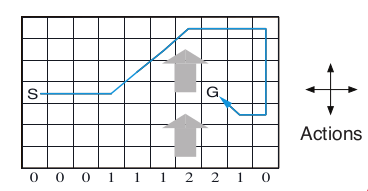

# Windy Gridworld MDP

The Windy gridworld MDP example from Chapter 6 of the textbook
"Reinforcement Learning: An Introduction."

## Format

An object of class
[MDP](http://michael.hahsler.net/pomdp/reference/MDP.md).

## Details

The gridworld has the following layout:



The grid world is represented as a 7 x 10 matrix of states. In the
middle region the next states are shifted upward by wind (the strength
in number of squares is given below each column). For example, if the
agent is one cell to the right of the goal, then the action left takes
the agent to the cell just above the goal.

No discounting is used (i.e., \\\gamma = 1\\).

## References

Richard S. Sutton and Andrew G. Barto (2018). Reinforcement Learning: An
Introduction Second Edition, MIT Press, Cambridge, MA.

## See also

Other MDP_examples:
[`Cliff_walking`](http://michael.hahsler.net/pomdp/reference/Cliff_walking.md),
[`DynaMaze`](http://michael.hahsler.net/pomdp/reference/DynaMaze.md),
[`MDP()`](http://michael.hahsler.net/pomdp/reference/MDP.md),
[`Maze`](http://michael.hahsler.net/pomdp/reference/Maze.md)

Other gridworld:
[`Cliff_walking`](http://michael.hahsler.net/pomdp/reference/Cliff_walking.md),
[`DynaMaze`](http://michael.hahsler.net/pomdp/reference/DynaMaze.md),
[`Maze`](http://michael.hahsler.net/pomdp/reference/Maze.md),
[`gridworld`](http://michael.hahsler.net/pomdp/reference/gridworld.md)

## Examples

``` r
data(Windy_gridworld)
Windy_gridworld
#> MDP, list - Windy Gridworld
#>   Discount factor: 1
#>   Horizon: Inf epochs
#>   Size: 70 states / 4 actions
#>   Start: s(4,1)
#> 
#>   List components: ‘name’, ‘discount’, ‘horizon’, ‘states’, ‘actions’,
#>     ‘transition_prob’, ‘reward’, ‘info’, ‘start’

gridworld_matrix(Windy_gridworld)
#>      [,1]     [,2]     [,3]     [,4]     [,5]     [,6]     [,7]     [,8]    
#> [1,] "s(1,1)" "s(1,2)" "s(1,3)" "s(1,4)" "s(1,5)" "s(1,6)" "s(1,7)" "s(1,8)"
#> [2,] "s(2,1)" "s(2,2)" "s(2,3)" "s(2,4)" "s(2,5)" "s(2,6)" "s(2,7)" "s(2,8)"
#> [3,] "s(3,1)" "s(3,2)" "s(3,3)" "s(3,4)" "s(3,5)" "s(3,6)" "s(3,7)" "s(3,8)"
#> [4,] "s(4,1)" "s(4,2)" "s(4,3)" "s(4,4)" "s(4,5)" "s(4,6)" "s(4,7)" "s(4,8)"
#> [5,] "s(5,1)" "s(5,2)" "s(5,3)" "s(5,4)" "s(5,5)" "s(5,6)" "s(5,7)" "s(5,8)"
#> [6,] "s(6,1)" "s(6,2)" "s(6,3)" "s(6,4)" "s(6,5)" "s(6,6)" "s(6,7)" "s(6,8)"
#> [7,] "s(7,1)" "s(7,2)" "s(7,3)" "s(7,4)" "s(7,5)" "s(7,6)" "s(7,7)" "s(7,8)"
#>      [,9]     [,10]    
#> [1,] "s(1,9)" "s(1,10)"
#> [2,] "s(2,9)" "s(2,10)"
#> [3,] "s(3,9)" "s(3,10)"
#> [4,] "s(4,9)" "s(4,10)"
#> [5,] "s(5,9)" "s(5,10)"
#> [6,] "s(6,9)" "s(6,10)"
#> [7,] "s(7,9)" "s(7,10)"
gridworld_matrix(Windy_gridworld, what = "labels")
#>      [,1]    [,2] [,3] [,4] [,5] [,6] [,7] [,8]   [,9] [,10]
#> [1,] ""      ""   ""   ""   ""   ""   ""   ""     ""   ""   
#> [2,] ""      ""   ""   ""   ""   ""   ""   ""     ""   ""   
#> [3,] ""      ""   ""   ""   ""   ""   ""   ""     ""   ""   
#> [4,] "Start" ""   ""   ""   ""   ""   ""   "Goal" ""   ""   
#> [5,] ""      ""   ""   ""   ""   ""   ""   ""     ""   ""   
#> [6,] ""      ""   ""   ""   ""   ""   ""   ""     ""   ""   
#> [7,] ""      ""   ""   ""   "X"  "X"  "X"  "X"    ""   ""   

# The Goal is an absorbing state 
which(absorbing_states(Windy_gridworld))
#> s(4,8) 
#>     53 

# visualize the transition graph
gridworld_plot_transition_graph(Windy_gridworld, 
  vertex.size = 10, vertex.label = NA)


# solve using value iteration
sol <- solve_MDP(Windy_gridworld) 
sol
#> MDP, list - Windy Gridworld
#>   Discount factor: 1
#>   Horizon: Inf epochs
#>   Size: 70 states / 4 actions
#>   Start: s(4,1)
#>   Solved:
#>     Method: ‘value iteration’
#>     Solution converged: TRUE
#> 
#>   List components: ‘name’, ‘discount’, ‘horizon’, ‘states’, ‘actions’,
#>     ‘transition_prob’, ‘reward’, ‘info’, ‘start’, ‘solution’
policy(sol)
#>      state   U action
#> 1   s(1,1) -15  right
#> 2   s(2,1) -15  right
#> 3   s(3,1) -15  right
#> 4   s(4,1) -15  right
#> 5   s(5,1) -15  right
#> 6   s(6,1) -15  right
#> 7   s(7,1) -15  right
#> 8   s(1,2) -14  right
#> 9   s(2,2) -14  right
#> 10  s(3,2) -14  right
#> 11  s(4,2) -14  right
#> 12  s(5,2) -14  right
#> 13  s(6,2) -14  right
#> 14  s(7,2) -14  right
#> 15  s(1,3) -13  right
#> 16  s(2,3) -13  right
#> 17  s(3,3) -13  right
#> 18  s(4,3) -13  right
#> 19  s(5,3) -13  right
#> 20  s(6,3) -13  right
#> 21  s(7,3) -13  right
#> 22  s(1,4) -12  right
#> 23  s(2,4) -12  right
#> 24  s(3,4) -12  right
#> 25  s(4,4) -12  right
#> 26  s(5,4) -12  right
#> 27  s(6,4) -12  right
#> 28  s(7,4) -12  right
#> 29  s(1,5) -11  right
#> 30  s(2,5) -11  right
#> 31  s(3,5) -11  right
#> 32  s(4,5) -11  right
#> 33  s(5,5) -11  right
#> 34  s(6,5) -11  right
#> 35  s(7,5) -11  right
#> 36  s(1,6) -10  right
#> 37  s(2,6) -10  right
#> 38  s(3,6) -10  right
#> 39  s(4,6) -10  right
#> 40  s(5,6) -10  right
#> 41  s(6,6) -10  right
#> 42  s(7,6)  -2  right
#> 43  s(1,7)  -9  right
#> 44  s(2,7)  -9  right
#> 45  s(3,7)  -9  right
#> 46  s(4,7)  -9  right
#> 47  s(5,7)  -9  right
#> 48  s(6,7)  -1  right
#> 49  s(7,7)  -2  right
#> 50  s(1,8)  -8  right
#> 51  s(2,8)  -8  right
#> 52  s(3,8)  -8  right
#> 53  s(4,8)   0   down
#> 54  s(5,8)  -1   down
#> 55  s(6,8)  -2   down
#> 56  s(7,8)  -1     up
#> 57  s(1,9)  -7  right
#> 58  s(2,9)  -7  right
#> 59  s(3,9)  -6  right
#> 60  s(4,9)  -5  right
#> 61  s(5,9)  -1   left
#> 62  s(6,9)  -2   left
#> 63  s(7,9)  -2     up
#> 64 s(1,10)  -6   down
#> 65 s(2,10)  -5   down
#> 66 s(3,10)  -4   down
#> 67 s(4,10)  -3   down
#> 68 s(5,10)  -2   left
#> 69 s(6,10)  -3     up
#> 70 s(7,10)  -3   left
gridworld_plot_policy(sol)
```
